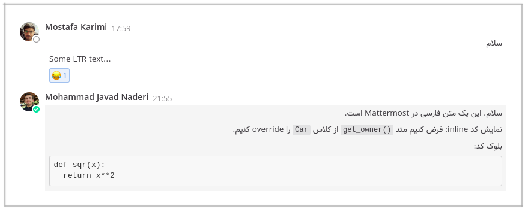
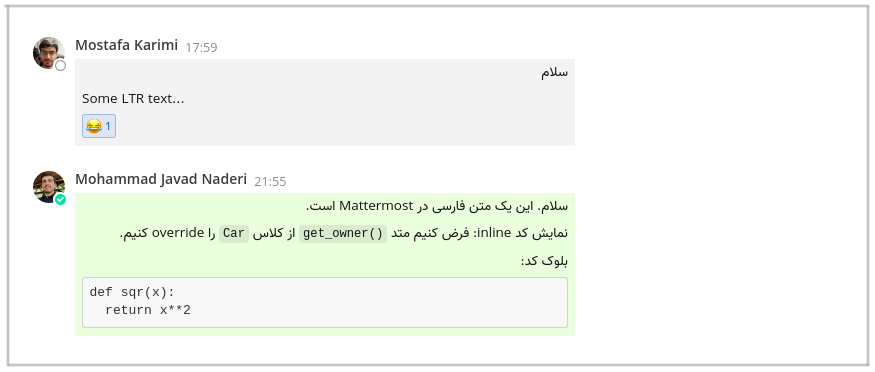

# Mattermost Chat UI

This plugin reduces width of message boxes
and applies other UI customizations to Mattermost chat messages.

**Before** enabling plugin:

**After** enabling plugin:

This repository is based on
[mattermost/mattermost-plugin-starter-template](https://github.com/mattermost/mattermost-plugin-starter-template).

## Installation

Download the plugin file (`ir.quera.mattermost-chat-ui-*.tar.gz`) from
[Releases](https://github.com/QueraTeam/mattermost-chat-ui/releases)
page and upload to your Mattermost
server via **System Console**.

## Other plugins:

- [mattermost-rtl](https://github.com/QueraTeam/mattermost-rtl)

## Development, Build

    make
